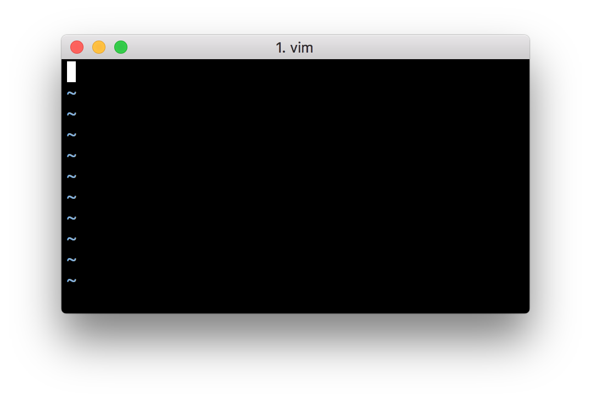
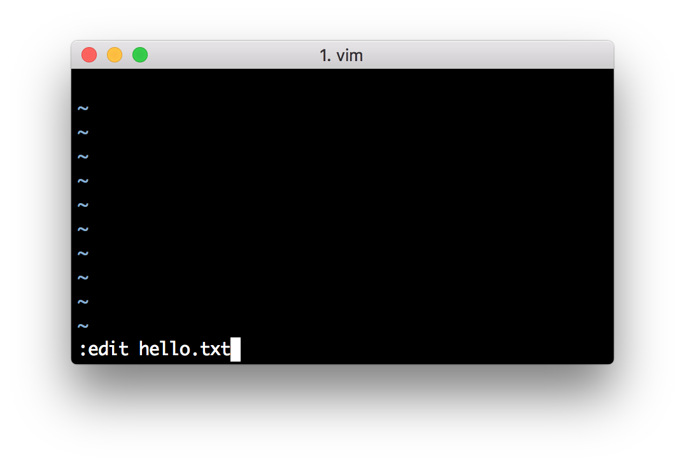
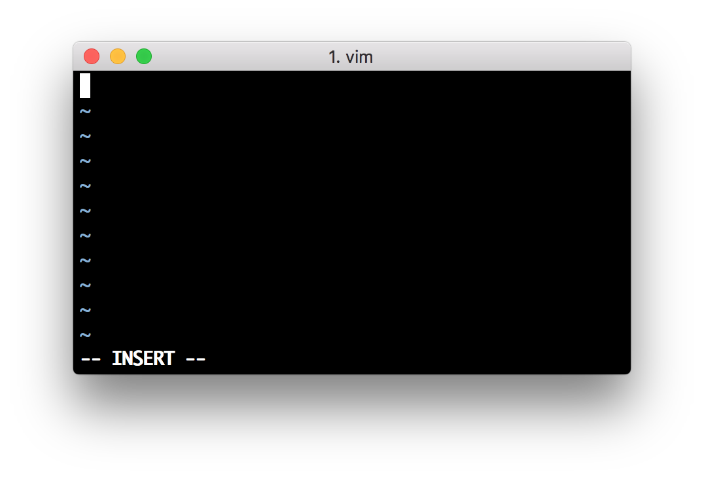
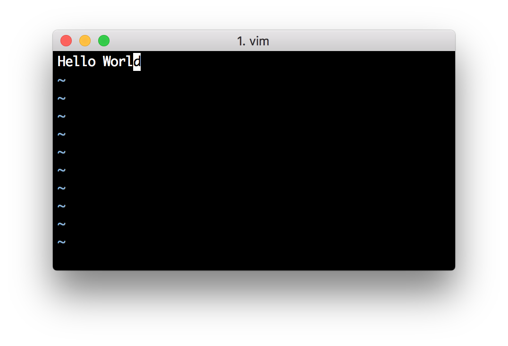
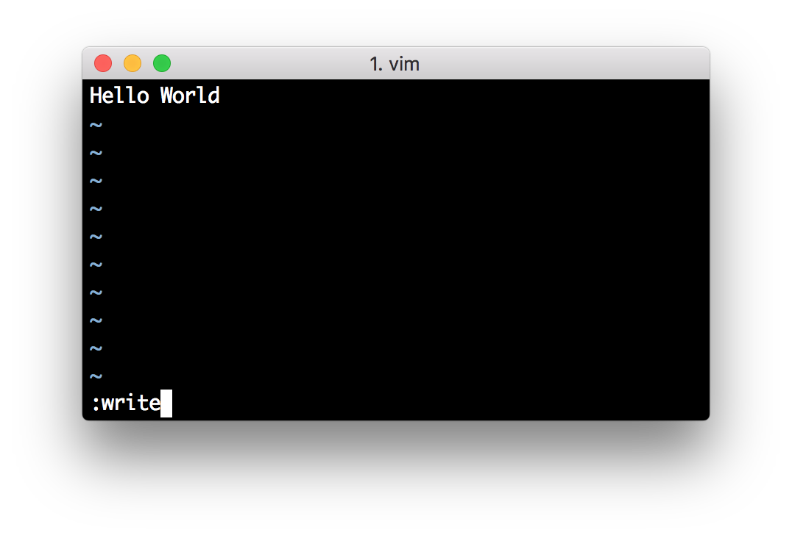
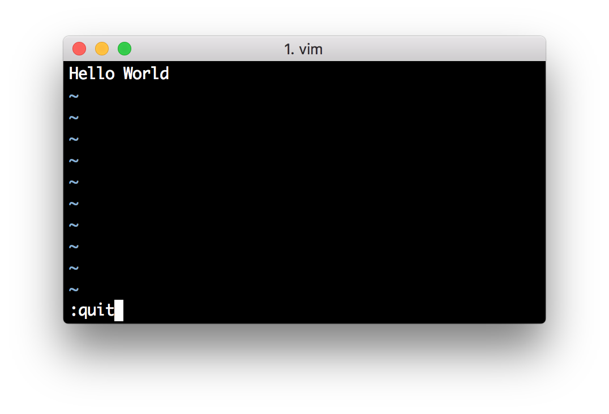

# First Steps

## Starting Vim

First step is, of course, to learn how to start Vim.

### Graphical Version

#### Windows

Click on Start &rarr; Programs &rarr; Vim 7 &rarr; gVim.

#### Mac OS X

Click on Finder &rarr; Applications &rarr; MacVim.

#### Linux / BSD

Click on Applications &rarr; Accessories &rarr; GVim Text Editor, or press `Alt+F2`, type `gvim` and press the `enter` key.

### Terminal version

#### Windows

Click on Start &rarr; Run, type `vim` and press the `enter` key.

#### Mac OS X

Click on Finder &rarr; Applications &rarr; Utilities &rarr; Terminal, type `vim` and press the `enter` key.

#### Linux / BSD

Click on Applications &rarr; Accessories &rarr; Terminal, or press `Alt+F2`, type `konsole`/`gnome-terminal` and press the `enter` key. Then, type `vim` and press the `enter` key.

### Summary

From now onwards when we say 'open Vim', use either of the two methods mentioned above.

> NOTE: When you started Vim, you might have noticed that you can't immediately start typing text. Don't panic, all will be explained in a little while.

## Graphical or Terminal?

The graphical version of Vim has menus at the top of the application as well as various options accessible via the mouse, but note that this is completely optional. You can still access all the features of Vim using *only* the keyboard.

Why is this important? Because once a person becomes efficient at typing, using only the keyboard makes the person much faster and less error-prone, as opposed to using the mouse. This is because the hand movement required to switch between the keyboard and the mouse is slow and there is a context switch required in the mind of the person when shifting the hand between the keyboard and the mouse. If we make it a habit to use the keyboard as much as possible, you're saving valuable hand movement.

Of course, this is subjective. Some people prefer the mouse and some prefer the keyboard. I encourage you to use the keyboard as much as possible to experience the real power of Vim.

## Introduction to Modes

Imagine it's a Saturday evening and you're bored of the shows on television. You want to watch an old favorite movie instead. So, you *switch the TV to video mode* so that it shows what the DVD player is displaying instead of the cable channels. Note that the television is still displaying video, but you switch the context on whether you want to watch a DVD or a live television channel.

Similarly, Vim has modes. For example, Vim has a mode for writing text, a mode for
running commands, etc. They are all related to the main purpose of editing text, but you switch context on whether you want to simply type stuff or you want to run some commands on the text.

Isn't that simple?

Traditionally, the concept of modes is the most oft-cited reason by beginners on why they find Vim "confusing". I compare it to riding a bicycle - you'll trip a few times, but once you've got the hang of it, you'll wonder what the fuss was all about.

So why does Vim have modes? To make things as simple as possible, even though it's usage may seem "strange" at first.

What do I mean by that? Let's take an example - one of the key goals in Vim is to make it fully accessible from the keyboard without ever having to need to use a mouse (you can still use the mouse if you want to but it is strictly optional). In such a scenario, how would you distinguish between the text you want to write, and the commands that you want to run? Vim's solution is to have a "normal" mode where you can execute commands and an "insert" mode where you are simply writing text. You can switch between the two modes any time. For example, pressing `i` switches Vim to insert mode, and pressing `<Esc>` switches Vim back to normal mode.

How do traditional editors achieve this distinction between commands and writing text? By using graphical menus and keyboard shortcuts. The problem is that this does not scale. First of all, if you have hundreds of commands, creating menus for each of these commands would be insane and confusing. Secondly, customizing how to use each of these commands would be even more difficult.

Let's take a specific example. Suppose you want to change all occurrences of the word "from" to the word "to" in a document. In a traditional editor, you can run a menu command like Edit &rarr; Replace (or use a keyboard shortcut like `ctrl-r`) and then enter the 'from' word and the 'to' word and then click on 'Replace'. Then, check the 'Replace All' option. In Vim, you simply run `:%s/from/to/g` in the normal mode. The `:s` is the "substitute" command. See how simpler this is?

What if you want to now run this substitution only in the first 10 lines of the text and you want to have a yes/no confirmation for each replacement? In traditional text editors, achieving the yes/no confirmation is easy by unchecking the 'Replace All' option, but notice that you have to first search for this option and then use the mouse to click on the option (or use a long series of keys using the keyboard). But how will you run the Replace for only the first 10 lines? In Vim, you can simply run `:0,10s/from/to/gc`. The new `c` option we are using means we want a 'c'onfirmation message for every replace.

By separating the writing (insert) and command (normal) modes, Vim makes it easy for us to switch the two contexts easily.

Notice how the first steps to using Vim seem a little "weird", a little "strange", but once you have seen it in action, it starts to make sense. The best part is that these core concepts will help you to understand all you need to know on how to use Vim.

Since you now understand the difference between normal mode and insert mode, you can look up the various commands you can run in the normal mode, and you can immediately start using them. Compare that to learning new commands in traditional editors which generally means having to read a lot of documentation, searching a lot of menus, a lot of trial and error or plain asking someone for help.

Personally, I find the names of the modes not intuitive to beginners. I prefer calling the insert mode as "writing" mode and the normal mode as "rewriting" mode, but we will stick to the standard Vim terminology to avoid confusion.

> NOTE: All commands in the normal mode should end with the enter key to signal Vim that we have written the full command. So, when we say run `:help vim-modes-intro`, it means you should type `:help vim-modes-intro` and then press the enter key at the end of the command.

## Writing a file {#write-file}

1. Open Vim.  
2. Type `:edit hello.txt` and press the enter key.  
3. Press `i` to switch to insert mode.  
4. Type the text `Hello World`.  
5. Press the `<Esc>` key.  
6. Type `:write` and press the `enter` key.  
7. Close Vim by running `:quit`.  

Congratulations! You just wrote your first file using Vim :-).

Does this seem like a lot of steps? Yes, it does, *at first*. That is because this is the first time we are getting used to opening Vim, writing a file and closing Vim. You have to keep in mind that this will only be a minor part of your time compared to the actual time that goes into in editing the content of the document.

Let us see what the above commands do.

- `:edit hello.txt` or simply `:e hello.txt`
  - This opens a file for editing. If the file with the specified name does not exist, it will be created the first time we "save" the file.
- Press `i`
  - This switches Vim to the insert mode
- Type the text `Hello World`
  - This is where you type the actual text that you want to write.
- Press `<Esc>`
  - This escapes Vim back to normal mode
- `:write` or simply `:w`
  - This tells Vim to *w*rite the text (which is currently stored in the computer's memory) to the file on the hard disk. This means that whatever we wrote so far is now permanently stored.
- `:quit` or simply `:q`
  - This tells Vim to quit the file in the "window" that we are editing. If there was only one "window" open, this will also close Vim (Concept of windows will be discussed in a later chapter). <!-- TODO: Convert this to a link -->

Try to repeat this process a few times with different file names, different text, etc. so that you get used to the basic set of steps in using Vim.

Notice that when you are in insert mode, Vim displays `-- INSERT --` at the bottom left corner. When you switch to normal mode, it will not display anything. This is because normal mode is the *default* mode in which Vim runs.

Take some time to soak in this information, this is probably the hardest lesson there is to learn about Vim, the rest is easy :)

And don't worry, help is not too far away. Actually, it's just a `:help` command away. For example, run `:help :edit` and you'll see the documentation open up. Go ahead, try it.

## Summary

We have now discussed the basic concepts and usage of Vim. See `:help notation` and `:help keycodes` also.

Be sure to understand these concepts well. Once you start "thinking in Vim", understanding the rest of Vim's features is easy.
