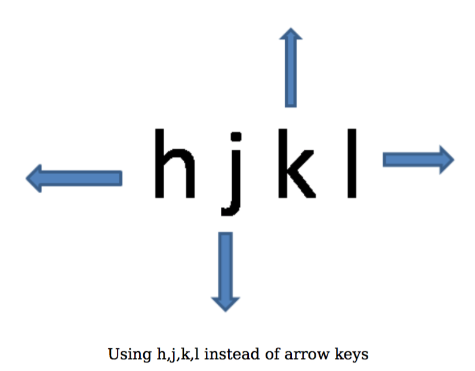

# Moving Around

Once you've written the initial text, editing and rewriting requires a lot of movement between the various parts of the document. For example, you're writing a story and you suddenly get an idea for a new plot, but to develop this plot you need to go back to the part where the protagonist enters the new city (or something like that)... how do you quickly move around the text so that you don't lose your train of thought?

Let's see a few examples of how Vim makes this fast.

- Want to move the cursor to the next word? Press `w`.
- Want to move to to the next paragraph? Press `}`.
- Want to move to the 3rd occurrence of the letter 'h'? Press `3fh`.
- Want to move 35 lines downwards? Press `35j`.
- After one of the above movements, want to jump back to the previous location? Press `ctrl-o`.

Want to learn how all these work? Let's dive in.

First, open a file called `chandrayaan.txt` and type the following [text from Wikipedia](http://en.wikipedia.org/wiki/Chandrayaan-1):

> Chandrayaan-1 is India's first mission to the moon. Launched by India's national space agency the Indian Space Research Organisation (ISRO). The unmanned lunar exploration mission includes a lunar orbiter and an impactor. The spacecraft was launched by a modified version of the PSLV XL on 22 October 2008 from Satish Dhawan Space Centre, Sriharikota, Andhra Pradesh at 06:23 IST (00:52 UTC). The vehicle was successfully inserted into lunar orbit on 8 November 2008. The Moon Impact Probe was successfully impacted at the lunar south pole at 20:31 hours on 14 November 2008.
>  
> The remote sensing satellite had a mass of 1,380 kilograms (3,042 lb) at launch and 675 kilograms (1,488 lb) at lunar orbit and carries high resolution remote sensing equipment for visible, near infrared, and soft and hard X-ray frequencies. Over a two-year period, it is intended to survey the lunar surface to produce a complete map of its chemical characteristics and 3-dimensional topography. The polar regions are of special interest, as they might contain ice. The lunar mission carries five ISRO payloads and six payloads from other international space agencies including NASA, ESA, and the Bulgarian Aerospace Agency, which were carried free of cost.

## Move your cursor, the Vim way

The most basic keys that you should use are the 'hjkl' keys. These 4 keys correspond to the left, down, up and right arrow keys respectively. Notice these keys are situated directly under your right hand when they are placed on the home row.

But why not use the arrow keys themselves? The problem is that they are located in a separate location in the keyboard and it requires as much hand movement as it requires to use a mouse.

Remember, that the right hand fingers should always be placed on `jkl;` keys (and the thumb on the space bar). Now, let's see how to use these 4 keys:

| Key | Mnemonic |
|:---:| --- |
| `h` | You have to stretch your index finger (which is on 'j') to the left to press the 'h'. This is the left-most key and signifies going left. |
| `j` | The drooping 'j' key signifies going down. |
| `k` | The upward pointing 'k' key signifies going up. |
| `l` | The right-most 'l' key signifies going right. |

Note that we can repeat the operation by prefixing a count. For example, `2j` will repeat the `j` operation 2 times.

Open up the `chandrayaan.txt` text document and start practicing these keys:

1. Position your cursor at the first letter 'C' of the document.
2. Press `2j` and it should skip the current long line, the blank line and go to the second line i.e. second paragraph.
3. Press `2k` to get back to where we were. Or alternatively, press `ctrl-o` to jump back.
4. Press `5l` to move 5 characters to the right.
5. Press `5h` to move left by 5 characters. Or alternatively, press `ctrl-o` to jump back.

Make it a habit to use the 'hjkl' keys instead of the arrow keys. Within a few tries, you'll notice how much faster you can be using these keys.

Similarly, there are more simple keys that replace the following special movements. Notice that this again is intended to reduce hand movement. In this particular case, people are prone to searching and hunting for these special keys, so we can avoid that altogether.

| Traditional | Vim |
| --- | --- |
| 'home' key moves to the start of the line | `^` key (think 'anchored to the start') |
| 'end' key moves to the end of the line | `$` key (think 'the buck stops here') |
| 'pgup' key moves one screen up | `ctrl-b` which means move one screen 'b'ackward |
| 'pgdn' key moves one screen down | `ctrl-f` which means move one screen 'f'orward |

If you know the absolute line number that you want to jump to, say line 50, press `50G` and Vim will jump to the 50th line. If no number is specified, `G` will take you to the last line of the file. How do you get to the top of the file? Simple, press `1G`. Notice how a single key can do so much.

- Move the cursor to the first line by pressing `1G`.
- Move 20 characters to the right by pressing `20l`.
- Move back to the first character by pressing `^`.
- Jump to the last character by pressing `$`.
- Press `G` to jump to the last line.

What if you wanted to the middle of the text that is currently being shown in the window?

- Press `H` to jump as 'h'igh as possible (first line of the window)
- Press `M` to jump to the 'm'iddle of the window
- Press `L` to jump as 'l'ow as possible (last line being displayed)

You must have started to notice the emphasis on touch-typing and never having to move your hands off the main area. That's a good thing.

## Words, sentences, paragraphs

We have seen how to move by characters and lines. But we tend to think of our text as words and how we put them together - sentences, paragraphs, sections, and so on. So, why not move across such text parts i.e. "text objects"?

Let's take the first few words from our sample text:

> The polar regions are of special interest, as they might contain ice.

First, let's position the cursor on the first character by pressing `^`.

> [T]he polar regions are of special interest, as they might contain ice.

<!-- -->

> NOTE: We are using the square brackets to mark the cursor position.

Want to move to the next 'w'ord? Press `w`. The cursor should now be at the 'p' in 'polar'.

> The [p]olar regions are of special interest, as they might contain ice.

How about moving 2 words forward? Just add the prefix count to 'w': `2w`.

> The polar regions [a]re of special interest, as they might contain ice.

Similarly, to move to the 'e'nd of the next word, press `e`.

> The polar regions ar[e] of special interest, as they might contain ice.

To move one word 'b'ackward, press `b`. By prefixing a count, `2b` will go back by 2 words.

> The polar [r]egions are of special interest, as they might contain ice.

See `:help word-motions` for details.

We have seen character motions and word motions, let's move on to sentences.

> [C]handrayaan-1 is India's first mission to the moon. Launched by India's national space agency the Indian Space Research Organisation (ISRO). The unmanned lunar exploration mission includes a lunar orbiter and an impactor. The spacecraft was launched by a modified version of the PSLV XL on 22 October 2008 from Satish Dhawan Space Centre, Sriharikota, Andhra Pradesh at 06:23 IST (00:52 UTC). The vehicle was successfully inserted into lunar orbit on 8 November 2008. The Moon Impact Probe was successfully impacted at the lunar south pole at 20:31 hours on 14 November 2008.

Position the cursor at the first character using `^`.

To move to the next sentence, press `)`.

> Chandrayaan-1 is India's first mission to the moon. [L]aunched by India's national space agency the Indian Space Research Organisation (ISRO). The unmanned lunar exploration mission includes a lunar orbiter and an impactor. The spacecraft was launched by a modified version of the PSLV XL on 22 October 2008 from Satish Dhawan Space Centre, Sriharikota, Andhra Pradesh at 06:23 IST (00:52 UTC). The vehicle was successfully inserted into lunar orbit on 8 November 2008. The Moon Impact Probe was successfully impacted at the lunar south pole at 20:31 hours on 14 November 2008.

Isn't that cool?

To move to the previous sentence, press `(`.

Go ahead, try it out and see how fast you can move. Again, you can prefix a count such as `3)` to move forward by 3 sentences.

Now, use the whole text and try out moving by paragraphs. Press `}` to move to the next paragraph and `{` to move to the previous paragraph.

Notice that the 'bigger' brackets is for the bigger text object. If you had already noticed this, then congratulations, you have already started to think like a winner, err, "think like a Vimmer".

Again, don't try to *remember* these keys, try to make it a *habit* such that your fingers naturally use these keys.

See `:help cursor-motions` for more details.

## Make your mark

You are writing some text but you suddenly remember that you have to update a related section in the same document, but you do not want to forget where you are currently so that you can come back to this later. What do you do?

Normally, this would mean scrolling to that section, update it, and then scroll back to where you were. This is a lot of overhead and we may tend to forget where we were last at.

We can do things a bit smarter in Vim. Move the cursor to the 5th line in the following text (the words by John Lennon). Use `ma` to create a mark named 'a'. Move the cursor to wherever you want, for example `4j`.

> I am eagerly awaiting my next disappointment. -- Ashleigh Brilliant  
> Every man’s memory is his private literature. -- Aldous Huxley  
> Life is what happens to you while you’re busy making other plans. -- John Lennon  
> Life is really simple, but we insist on making it complicated. -- Confucius  
> Do not dwell in the past, do not dream of the future, concentrate the mind on the present moment. -- Buddha  
> The more decisions that you are forced to make alone, the more you are aware of your freedom to choose. -- Thornton Wilder

Press `'a` (i.e. single quote followed by the name of the mark) and voila, Vim jumps (back) to the line where that mark was located.

You can use any alphabet (a-zA-Z) to name a mark which means you can have up to 52 named marks for each file.

## Jump around

In the various movements that we have learned, we might often want to jump back to the previous location or to the next location after a movement. To do this, simply press `ctrl-o` to jump to the previous location and `ctrl-i` to jump forward to the next location again.

## Parts of the text {#text-objects}

There are various ways you can specify text objects in Vim so that you can pass them to a command. For example, you want to visually select a part of the text and then convert the case (from upper to lower or from lower to upper case) of the text using the `~` key.

Open the `dapping.txt` file that we created in previous chapters. Use the various keys to move to the first letter of the word 'dapper' in the second paragraph. Hint: Use `}`, `j`, `w`.

> Dapping means being determined about being determined and being passionate about being passionate.  
> Be a dapper.

Press `v` to start the visual mode, and press `ap` to select 'a' 'p'aragraph. Press `~` to flip the case of the text. If you want to cancel the selection, simply press `<Esc>`.

> Dapping means being determined about being determined and being passionate about being passionate.  
> bE A DAPPER.

Other text object mnemonics are `aw` which means 'a' 'w'ord, `a"` means a quoted string (like "this is a quoted string"), `ab` means 'a' 'b'lock which means anything within a pair of parentheses, and so on.

See `:help object-motions` and `:help text-objects` for more details.

## Summary

We have seen the rich number of methods that Vim gives us to move around the text. It is not important to remember each of these movements, it is more important to make them a habit whenever you can, especially the ones that are most relevant to you, and when they become a habit they reduce the movement of your hands, you become faster, and ultimately spend more time on thinking about your writing rather than on the software you use to write.

See `:help various-motions` as well as `:help motion` for more interesting ways of movement.
