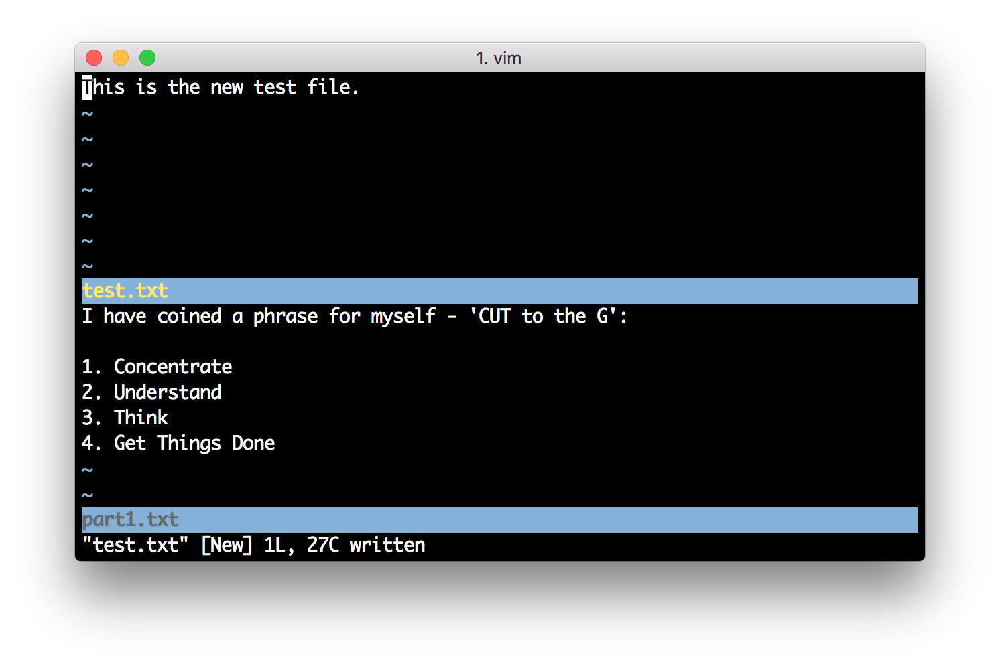
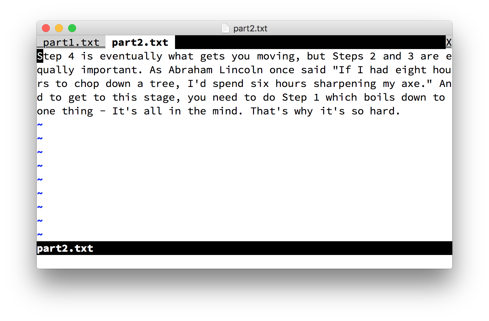

# Multiplicity

In this chapter, let's explore how Vim helps us work between different parts of the file, different files, different 'windows' and different tabs to help us to handle more simultaneously. After all, an important part about good editing is managing files.

## Multiple Sections using Folds

If you're editing a long document, wouldn't it be easier if you can "close" all sections of the document and focus on only one at a time?

This is what we call *folding* in Vim.

Let us take the example where your document is structured such that each level of the text is indented one level higher such as the following piece of text:

```
Book I
    The Shadow of the Past
        Three Rings for the Elven-kings under the sky,
        Seven for the Dwarf-lords in their halls of stone,
        Nine for Mortal Men doomed to die,
        One for the Dark Lord on his dark throne
        In the Land of Mordor where the Shadows lie.
        One Ring to rule them all, One Ring to find them,
        One Ring to bring them all and in the darkness bind them
        In the Land of Mordor where the Shadows lie.

    Three is Company

        The Road goes ever on and on
        Down from the door where it began.
        Now far ahead the Road has gone,
        And I must follow, if I can,
        Pursuing it with weary feet,
        Until it joins some larger way,
        Where many paths and errands meet.
        And whither then? I cannot say.
```

> NOTE: This text was [taken from WikiQuote](http://en.wikiquote.org/wiki/The_Fellowship_of_the_Ring).

After writing this text, run `:set foldmethod=indent`, position your cursor on the text you want to indent, press `zc` and see how the text folds up. Press `zo` to open the fold.

Basic commands are `zo` and `zc` where we can open and close the fold respectively. You can use `za` to 'a'lternate between opening and closing a fold respectively. You can make it even easier by using the spacebar (in normal mode) to open and close a fold:

``` viml
:nmap <space> za
```

Folding is a huge topic on its own with more ways of folding (manual, marker, expression) and various ways of opening and closing hierarchies of folds, and so on. See `:help folding` for details.

## Multiple Buffers

Suppose you wanted to edit more than one file at a time using the same Vim, what do you do?

Remember that files are loaded into buffers in Vim. Vim can also load multiple buffers at the same time. So, you can have multiple files open at the same time and you can keep switching between them.

Let's say you have two files, `part1.txt` and `part2.txt`:

*part1.txt*

> I have coined a phrase for myself - 'CUT to the G': <br>
> 1. Concentrate <br>
> 2. Understand <br>
> 3. Think <br>
> 4. Get Things Done

*part2.txt*

>  Step 4 is eventually what gets you moving, but Steps 2 and 3 are equally important. As Abraham Lincoln once said "If I had eight hours to chop down a tree, I'd spend six hours sharpening my axe." And to get to this stage, you need to do Step 1 which boils down to one thing - It's all in the mind. That's why it's so hard.

Now, run `:e part1.txt` and then run `:e part2.txt`. Observe that you have the second file now open for editing. How do you switch back to the first file? In this particular case, you can just run `:b 1` to switch to 'b'uffer number '1'. You can also run `:e part1.txt` to open the existing buffer into view.

You can see what buffers has been loaded and correspondingly, which files are being edited by running `:buffers` or a shorter form, `:ls` which stands for 'l'i's't buffers.

Buffers will be automatically removed when you close Vim, so you don't have to do anything special other than making sure you save your files. However, if you really want to remove a buffer, for example in order to use less memory, then you can use `:bd 1` to 'd'elete the 'b'uffer numbered '1', etc.

See `:help buffer-list` on the numerous things you can do with buffers.

## Multiple Windows

We have seen how to edit multiple files at the same time, but what if we wanted to view two different files simultaneously. For example, you want to have two different chapters of your book open so that you can write the second chapter consistent with the wordings/description given in the first chapter. Or you want to copy/paste some stuff from the first file to the second file.

In the last section, we used the same "view" to edit multiple buffers. Vim calls these "views" as windows. This term "window" should *not* be confused with your desktop application window which usually means the entire application itself. Just think of 'windows' as 'views' on different files.

Let's take the same `part1.txt` and `part2.txt` sample files used in the previous section.

First, load the part1.txt using `:e part1.txt`. Now, let's open a new buffer by splitting the window to create a new window - run `:new`. You should now be able to do any normal editing in the new buffer in the new window, except that you can't save the text because you haven't associated a file name with the buffer. For that, you can use `:w test.txt` to save the buffer.



How do you switch between these two windows? Just use `ctrl-w <motion key>` to switch between the windows. Motion keys can be one of `h`, `j`, `k`, `l` or even any of the arrow keys (in this example, only up and down keys make sense). Remember that `ctrl-w` operations work on 'w'indows.

As a quick shortcut, you can press `ctrl-w` twice i.e. `ctrl-w ctrl-w` to cycle between all the open windows.

A particular situation where multiple windows are useful is when you want to view two different parts of the same file simultaneously. Just run `:sp` to create a 'sp'lit window and then you can scroll each window to a different position and continue your editing. Since they both are "windows" to the same buffer, changes in one window will be immediately reflected in the other window. You can also use `ctrl-w s` instead of `:sp`.

To create a vertical split, use `:vsp` or `ctrl-w v`. To close a window, just run `:q`.

Now that we have seen how to open and use multiple windows, let's see how to further play around with the display.

- Suppose you have two split windows but want to reverse the windows, so that you can focus your eyes on the bottom part or top part of your computer screen, as per your preference? Press `ctrl-w r` to 'r'otate the windows.
- Want to move the current window to the topmost position? Press `ctrl-w K`.
- Want to resize a window to make it smaller or larger? Run `:resize 10` to make it 10 lines long display, etc.
- Want to make the current window as big as possible so that you can concentrate on it? Press `ctrl-w _`. Think of the underscore as an indication that the other windows should be as small as possible.
- Want to make the windows 'equal' in height again? Press `ctrl-w =`.

See `:help windows` on more details on what you can do with windows.

## Multiple Tabs

In web browsers (such as Firefox, Google Chrome or Safari), you may have used the tabs feature which allows you to open multiple websites in a single window so that you can switch between them without having the headache of switching between multiple windows. Well, tabs work exactly the same way in Vim also. Except that they are called "tab pages."

Run `:tabnew` to open a new tab with a new buffer (analogous to `:new`). How do you switch between the tabs? By pressing `gt` to 'g'o to the next 't'ab and `gT` to 'g'o in the opposite direction i.e. the previous 't'ab.



I personally prefer to use the keys `alt-j` and `alt-k` for the same operations analogous to how the `j` and `k` keys work for characters and how `ctrl-w j` and `ctrl-w k` work for (horizontally split) windows. To enable this, add the following lines to your vimrc file:

``` viml
" Shortcuts for moving between tabs.
" Alt-j to move to the tab to the left
noremap <A-j> gT
" Alt-k to move to the tab to the right
noremap <A-k> gt
```

To 'c'lose a 'tab', run `:tabc` or `:q`.

You can even open text that opens in a new window to open in a new tab instead. For example, `:help tabpage` opens the help in a horizontally split window. To view it in a new tab instead, use `:tab help tabpage`.

If you want to reorder the tabs, use `:tabmove`. For example, to move the current tab to the first position, use `:tabmove 0` and so on.

See `:help tabpage` for more details on tab pages and the other operations that you can run, such as `:tabdo` to operate on each of the tab pages which are open, and customizing the title of the tab pages (`:help setting-guitablabel`), etc.

## Summary

Vim provides a number of ways to edit multiple files at the same time - buffers, windows and tabs. Using these features depends on your personal habit. For example, using multiple tabs may obviate the usage of multiple windows. It's important to use the one which is most convenient and comfortable.
