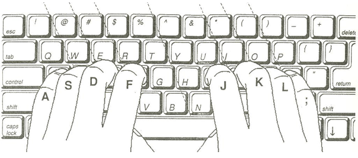

# Typing Skills

We just learned about how to switch between the three basic modes in Vim. Isn't it hard to remember all those keys? How do you remember which key is for which operation? Well, that's the "key" question. The answer is that you shouldn't "remember", *your fingers should automatically know what to do!*. It must (literally) be on your finger tips.

So how do we do that? By making it a habit. Walking is not a nature that humans have at birth, but after trying a bit and by habit, we learn to walk. Same with Vim, although it requires less effort.

Vim was designed for people who are familiar with the keyboard. Why? Because we spend most of our time in editing tasks, which implicitly make extensive use of the keyboard, and the faster we are able to type, the faster we get the work done.

Let's start with a basic technique to get you comfortable with the keyboard.

## Home Row Technique

Place your fingers on the [home row](http://en.wikipedia.org/wiki/Home_row) of the keyboard by positioning your hands such that the fingers of your left hand are on the `ASDF` keys and the fingers of your right hand are on the `JKL;` keys as shown in the [drawing (artist unknown)](http://www.bigpants.ca/juggling/images/Controls_Keyboard_HomeRow.gif).

Getting your hands to be comfortable in this position is one of the most important steps in learning how to use the keyboard effectively. The idea is that you should be able to type any key using the finger that is closest to that key and then your finger should automatically come back to its original position. It might seem difficult at first but try it a couple of times and you will see that you will type much faster this way.

Note that most keyboards have some home row markers on the `F` and `J` keys which serves as a reminder for you on where your fingers should be placed.

Now, try typing the alphabets A-Z using the home row technique.

Relatedly, there is also a [free online typing tutorial](http://www.typeonline.co.uk/lesson1.html) available that explains the basics of typing skills. I would encourage you to try it for just ten minutes and explore.

## Vim graphical keyboard cheat sheet

If you want to know how each key can map to something useful in Vim, see this [Vim graphical cheat sheet by 'jng'](http://www.viemu.com/a_vi_vim_graphical_cheat_sheet_tutorial.html).

Although a *lot* of commands are listed, for now you only need to learn the basic 'hjkl' keys which translates to left, down, up, right keys respectively. You'll learn more about this in the next chapter.

## Summary

Notice that our efficiency in using Vim is directly proportional to the efficiency of using the keyboard.
